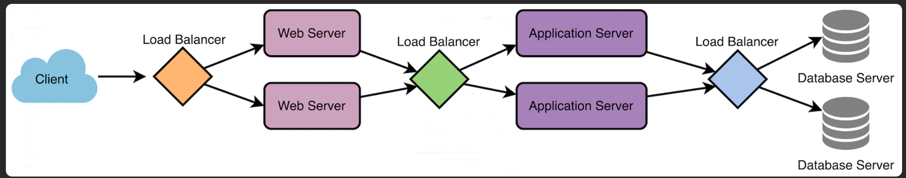

# What is Load Balancing

- Sits between the client and the server accepting incoming network and application traffic
- Helps distribute incoming requests and traffic evenly across multiple servers
- Ensure high availability, reliability and performance
- Prevent single point of failure of the server

## Terminology Definition

### Load Balancer

- Distributes network traffic across multiple servers based on rules or algorithms
- Can be software or hardware device

### Backend Server/ Server Pool

- Receive and process requests forwarded by the load balancer

### Load Balancing Algorithm

- Determine how to distribute incoming traffic among the backend servers

### Health Checks

- Periodic tests performed by the load balancer to check the state of the backend server

### Session Persistence

- Ensure that subsequent requests from the same client are directed to the same backend server
- Maintain session state
- Provide a consistent user experience

### SSL/TLS Termination

- Decrypting SSL/TLS-encrypted traffic at the load balancer level
- Offloading the descryption burden form backend servers
- Allow for centralized SSL/TLS management

## Where Load Balancer can be added

- Between user and the web server
- Between web server and an internal platform layer (application/cache server)
- Between internal platform layer and database

## How Load Balancer works

1. Load Balancer (LB) receives a request from client/user
2. LB evaluates the request and determines which server (resource )should handle the request based on its algorithm. Taking into account such as server capacity, server response time, number of active connections and geographic location
3. LB forwards the incoming traffic to the selected server
4. The server processes the request and sends a response back to the LB
5. LB receives the response from server and send it to the client/user who made the request

# Use Case of Load Balancing

## Improving web performance

- Load Balancing can distribute incoming web traffic among multiple servers
- Reducing load on individual server and ensuring faster response time

## Ensuring High Availability and Reliability

- Prevent server to be single points of failure
- Maintain uptime and minimize service disruptions

## Scalability

- Allows organizations to easily scale the infrastructure as traffic and demand increase
- Can add more servers to accommodate increased demand with little infrastructure changes

## Redundancy

- Maintain redundant copies of data and services across multiple servers
- Reducing the risk of data loss or service outrages

## Network optimization

- Optimize network traffic by distributing it across multiple links
- Reduce congestion and improve overall network performance

## Geographic distribution

- Distribute traffic across data centers in different geographic locations
- Direct user to nearest or best performing data center to reduce latency

## Application performance

- Ensure that each application or service receives the necessary resources to perform optimally

## Security

- Protect against distributed denial-of-service (DDoS) attacks by distributing incoming traffic across multiple servers

## Cost savings

- Help organizations save money on infrastructure costs and reduce energy consumption

## Content caching

- Cache static content such as images and videos
- Cached content is served directly from the load balancer
- Reduce the demand on servers and provide faster response times

